# 카페 관리 시스템 클래스다이어그램

```mermaid
classDiagram
    class Program {
        +Main(string[] args) void
    }

    class CafeManagementSystem {
        -Cafe cafe
        -int nextOrderNumber
        +Run() void
        -RegisterOrder() void
        -CreatePaymentRecord(int amount) Payment
        -CancelOrderRecord() void
        -StockMenu() void
        -EmployeeMenu() void
        -RegisterEmployee() void
        -RegisterEmployeeSchedule() void
    }

    class Cafe {
        +string Name
        +string Address
        +int BranchNumber
        +List~Menu~ Menus
        +List~Employee~ Employees
        +List~Order~ Orders
        +InventoryManager Inventory
        -int totalSales
        -int totalCost
        +AddMenu(Menu menu) void
        +HireEmployee(Employee employee) void
        +RemoveEmployee(string name) bool
        +BuyStock(string ingredient, int amount, int unitPrice) void
        +ProcessOrder(Order order) bool
        +CancelOrder(int orderNumber) bool
        +ShowSalesReport() void
    }

    class InventoryManager {
        -Dictionary~string,int~ stock
        -Dictionary~string,int~ ingredientPrice
        +AddStock(string ingredient, int amount) void
        +SetIngredientPrice(string ingredient, int price) void
        +TryGetStockInfo(string ingredient, out int amount, out int price) bool
        +HasStock(string ingredient, int amount) bool
        +UseStock(string ingredient, int amount) bool
        +ShowStock() void
    }

    class Recipe {
        +string Name
        +Dictionary~string,int~ Ingredients
        +AddIngredient(string name, int amount) void
        +ShowRecipe() void
    }

    class Menu {
        <<abstract>>
        #string name
        #int price
        #Recipe recipe
        +string Name
        +int Price
        +Recipe Recipe
        +HowMuch()* int
        +Info() string
        +RequiredIngredients() Dictionary~string,int~
        +CompareTo(Menu other) int
    }

    class CoffeeMenu {
        -MenuSize size
        +MenuSize Size
        +HowMuch() int
        +Info() string
    }

    class Person {
        <<abstract>>
        #string name
        #string phone
        +string Name
        +string Phone
        +Role()* string
        +Info() string
    }

    class Customer {
        -int point
        +int Point
        +AddPoint(int amount) void
        +UsePoint(int amount) bool
        +Role() string
        +Info() string
    }

    class WorkSchedule {
        -DayOfWeek day
        -int startHour
        -int endHour
        +IsWorkingAt(DateTime dateTime) bool
        +Info() string
    }

    class Employee {
        <<abstract>>
        #int pay
        #EmploymentType employmentType
        #Diligence diligence
        -List~WorkSchedule~ schedules
        +AddSchedule(DayOfWeek day, int startHour, int endHour) void
        +CurrentStatus() workingStatus
        +IsWorking() bool
        +CalculatePay(int hours) int
        +Role() string
        +Info() string
    }

    class Barista {
        +Role() string
    }

    class Manager {
        +Role() string
        +CalculatePay(int hours) int
        +Info() string
    }

    class OrderLine {
        -Menu menu
        -int quantity
        -int unitPrice
        +Menu Menu
        +int Quantity
        +int UnitPrice
        +TotalPrice() int
        +RequiredIngredients() Dictionary~string,int~
        +Info() string
    }

    class Order {
        -int orderNumber
        -Customer customer
        -List~OrderLine~ lines
        -OrderStatus status
        -OrderType ordertype
        -Payment payment
        -DateTime orderedAt
        +AddMenu(Menu menu) void
        +AddMenu(Menu menu, int quantity) void
        +CancelOrder(int orderNumber) bool
        +TotalQuantity() int
        +MenuPrice() int
        +OptionPrice() int
        +TotalPrice() int
        +Pay(Payment payment) bool
        +Info() string
        +ShowOrder() void
    }

    class Payment {
        <<abstract>>
        #int amount
        #DateTime paidAt
        +int Amount
        +DateTime PaidAt
        +Pay()* bool
        +TotalPrice() int
        +Info() string
    }

    class CashPayment {
        +Pay() bool
        +Info() string
    }

    class CardPayment {
        +Pay() bool
        +Info() string
    }

    class SalesSummary {
        <<struct>>
        +int OrderCount
        +int SoldQuantity
        +int Sales
        +int Cost
        +int Profit
        +Show() void
    }

    class SearchHelper {
        <<static>>
        +TryFind~T~(List~T~ items, Predicate~T~ condition, out T result) bool
    }

    class CafeException {
        +CafeException(string message)
    }

    class StockShortageException {
        +StockShortageException(string message)
    }

    class InvalidOrderException {
        +InvalidOrderException(string message)
    }

    class IDisplayable {
        <<interface>>
        +Info() string
    }

    class IPriced {
        <<interface>>
        +TotalPrice() int
    }

    class IStockUsable {
        <<interface>>
        +RequiredIngredients() Dictionary~string,int~
    }

    class IComparable_Menu {
        <<interface>>
        +CompareTo(Menu other) int
    }

    class MenuSize {
        <<enumeration>>
        Tall
        Grande
        Venti
    }

    class OrderStatus {
        <<enumeration>>
        Completed
        Canceled
    }

    class OrderType {
        <<enumeration>>
        InStore
        TakeOut
        Delivery
    }

    class EmploymentType {
        <<enumeration>>
        PartTime
        FullTime
    }

    class workingStatus {
        <<enumeration>>
        Working
        NotWorking
    }

    class Diligence {
        <<enumeration>>
        VeryGood
        Good
        Normal
        Bad
    }

    Program --> Cafe
    Program --> CafeManagementSystem

    CafeManagementSystem --> Cafe

    Cafe *-- InventoryManager
    Cafe o-- Menu
    Cafe o-- Employee
    Cafe o-- Order
    Cafe --> SalesSummary
    Cafe --> SearchHelper

    Recipe <-- Menu
    Menu <|-- CoffeeMenu
    Menu --> MenuSize

    Person <|-- Customer
    Person <|-- Employee
    Employee <|-- Barista
    Employee <|-- Manager
    Employee *-- WorkSchedule
    Employee --> EmploymentType
    Employee --> Diligence
    Employee --> workingStatus

    Order *-- OrderLine
    Order --> Customer
    Order --> Payment
    Order --> OrderStatus
    Order --> OrderType
    OrderLine --> Menu

    Payment <|-- CashPayment
    Payment <|-- CardPayment

    CafeException <|-- StockShortageException
    CafeException <|-- InvalidOrderException

    IDisplayable <|.. Person
    IDisplayable <|.. WorkSchedule
    IDisplayable <|.. Menu
    IDisplayable <|.. OrderLine
    IDisplayable <|.. Order
    IDisplayable <|.. Payment

    IPriced <|.. OrderLine
    IPriced <|.. Order
    IPriced <|.. Payment

    IStockUsable <|.. Menu
    IStockUsable <|.. OrderLine

    IComparable_Menu <|.. Menu
```

## 읽는 순서

1. `Program`이 `Cafe`와 `CafeManagementSystem`을 만든다.
2. `CafeManagementSystem`은 사용자의 입력을 받고 `Cafe` 기능을 호출한다.
3. `Cafe`는 메뉴, 직원, 주문, 재고, 매출 정보를 관리한다.
4. `Menu`는 `Recipe`를 가지고, `OrderLine`은 메뉴와 수량을 저장한다.
5. `Order`는 여러 `OrderLine`과 `Payment`를 가진 주문 기록이다.
6. `Employee`는 여러 `WorkSchedule`을 가지고 현재 근무 상태를 계산한다.
